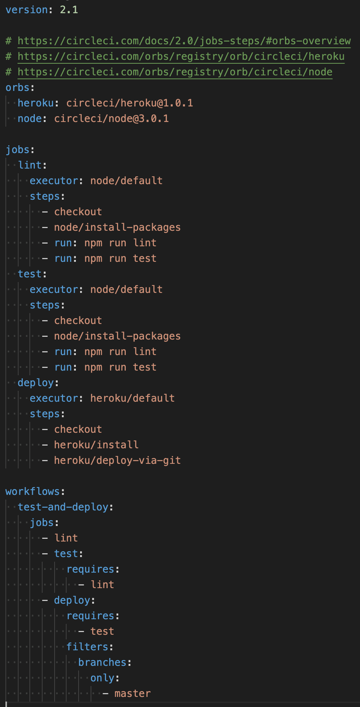
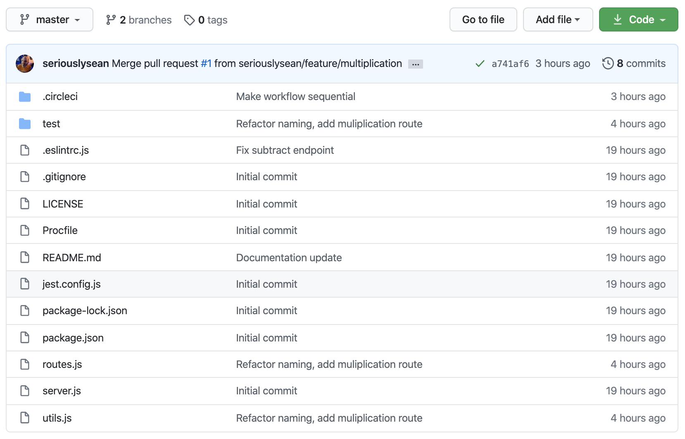
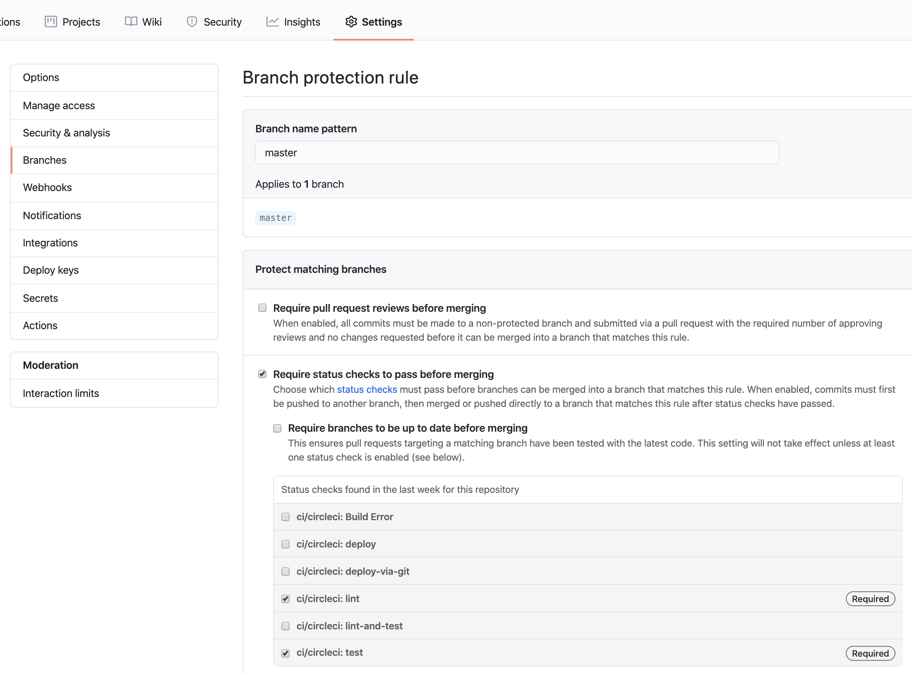
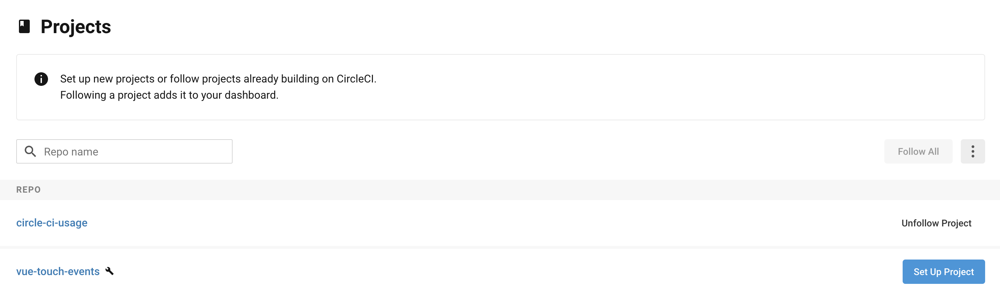
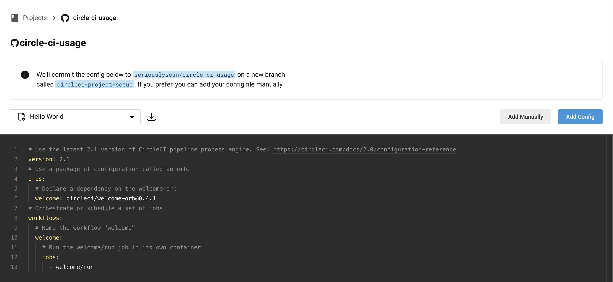
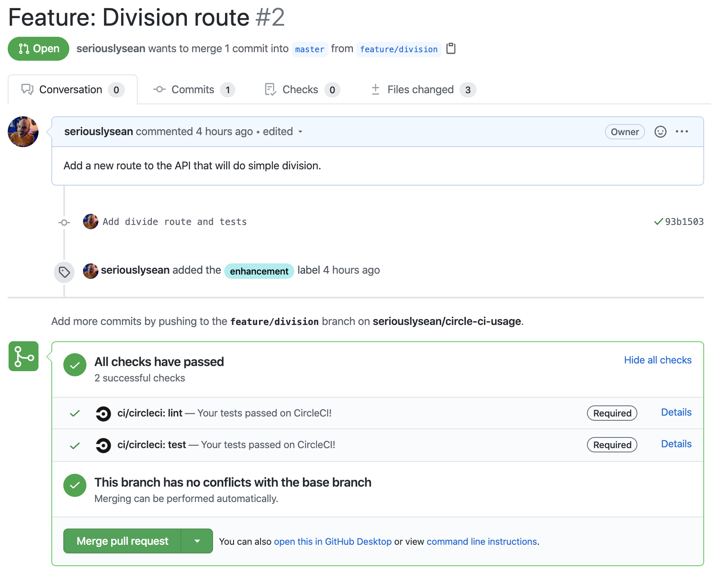
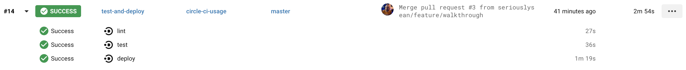

# Walkthrough

* [Create a CircleCI Config](#create-a-circleci-config)
* [Push Repo to GitHub](#push-repo-to-github)
* [Configure Branch Rules](#configure-branch-rules)
* [Configure CircleCI Project](#configure-circleci-project)
* [See It All In Action](#see-it-all-in-action)

## Create a CircleCI Config

First, we need a CircleCI configuration file.

1. Create `.circleci/config.yml` in the root of the repo
2. Add at least one job and one workflow to run on a given branch
    - _Linting or Testing is a good first option_

<figure>
    
    <figcaption>Config values may vary, this project has one for Heroku</figcaption>
</figure>

https://github.com/seriouslysean/circle-ci-usage/blob/master/.circleci/config.yml

## Push Repo to GitHub

We'll also need the [project hosted on GitHub](https://github.com/seriouslysean/circle-ci-usage) so we can hook everything up to CircleCI for automated testing.

1. Ensure you've create a git repo via `git init`
2. Push the repository to GitHub

<figure>
    
    <figcaption>You can also use an existing repository</figcaption>
</figure>

## Configure Branch Rules

We want to make sure that our repo requires builds to pass (such as Pull Requests) before being able to merge them.

1. Go to the repo settings page
2. Navigate to the branches section
3. Edit a given branch (in this case `master`)
4. Enable the `Require status checks to pass before merging` setting

<figure>
    
    <figcaption>You will not see any status checks in the list until you configure CircleCI</figcaption>
</figure>

## Configure CircleCI Project

In order to make use of CircleCI's platform, we'll need to setup our repo as a project.

1. Create or log in to your CircleCI account
2. Click `Setup Project`
3. Click `Add Manually` and then `Start Building`
    - _Our repo already has a `.circleci/config.yml` file_

<figure>
    
    <figcaption>List of projects on CircleCI</figcaption>
</figure>

<figure>
    
    <figcaption>Your project setup screen may differ based on your repo code</figcaption>
</figure>

_Note: At this point you should be able to make the status checks in GitHub required._

## See It All In Action

1. Push up a PR
2. See the status checks

<figure>
    
    <figcaption>All tests passed! :)</figcaption>
</figure>

<figure>
    
    <figcaption>I also have a deploy step</figcaption>
</figure>

_Note: This app deploys to http://circle-ci-usage.herokuapp.com/._
